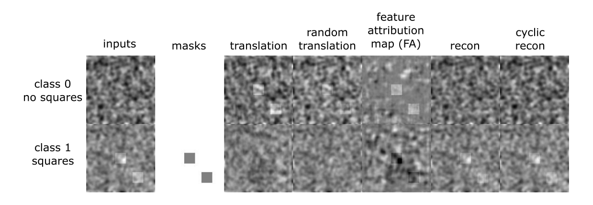

# ICAM: Interpretable Classification via Disentangled Representations and Feature Attribution Mapping

Feature attribution (FA), or the assignment of class-relevance to different locations in an image, is important for many classification problems but is particularly crucial within the neuroscience domain, where accurate mechanistic models of behaviours, or disease, require knowledge of all features discriminative of a trait. At the same time, predicting class relevance from brain images is challenging as phenotypes are typically heterogeneous, and changes occur against a background of significant natural variation. Here, we present a novel framework for creating class specific FA maps through image-to-image translation. We propose the use of a VAE-GAN to explicitly disentangle class relevance from background features for improved interpretability properties, which results in meaningful FA maps. We validate our method on 2D and 3D brain image datasets of dementia (ADNI dataset), ageing (UK Biobank), and (simulated) lesion detection. We show that FA maps generated by our method outperform baseline FA methods when validated against ground truth. More significantly, our approach is the first to use latent space sampling to support exploration of phenotype variation. 

This figure from the paper shows a comparison of different feature attribution methods for the ADNI dataset (Alzhiemer's dataset - conversion of AD to MCI) using a ground truth mask.

## Summary
We developed a method for feature attribution which supports 2D and 3D datasets for the tasks of classification and regression.
New datasets are easy to set up, requiring the desired dataset, and minimal addition of dataloader code.
Multi-class classification is also possible, but will require setting up an appropriate dataloader, and updating the training code.

Since we cannot release the datasets used in the paper, we instead provide an example using a simulated datasets of noise and squares.

Below is an example of a simulated dataset (on the left) of 2 classes - 1 noisy image with squares, and one without squares. The goal is to find the squares, and achieve translation between the classes.

## Reference

https://arxiv.org/abs/2006.08287

If this repository was useful to your work, please consider citing us:
`@article{bass2020icam,
  title={ICAM: Interpretable Classification via Disentangled Representations and Feature Attribution Mapping},
  author={Bass, Cher and da Silva, Mariana and Sudre, Carole and Tudosiu, Petru-Daniel and Smith, Stephen and Robinson, Emma},
  journal={arXiv preprint arXiv:2006.08287},
  year={2020}
}`

