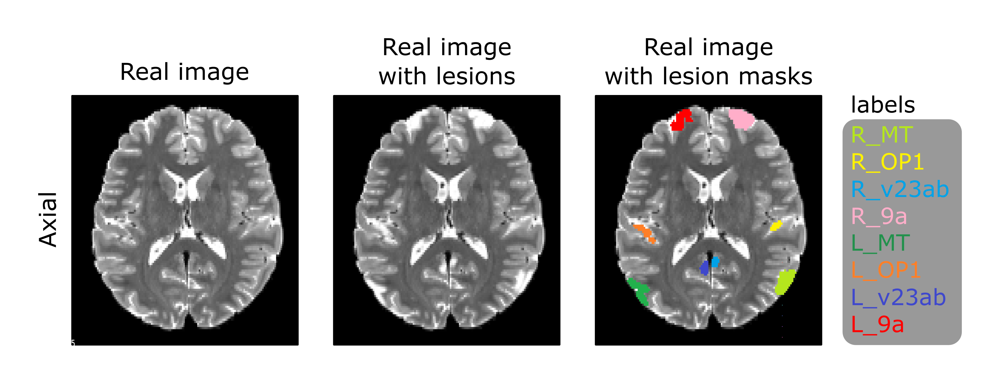
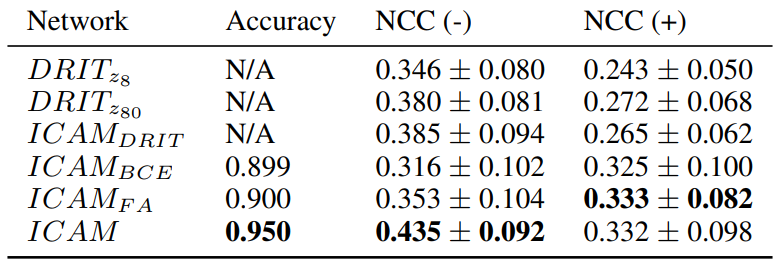
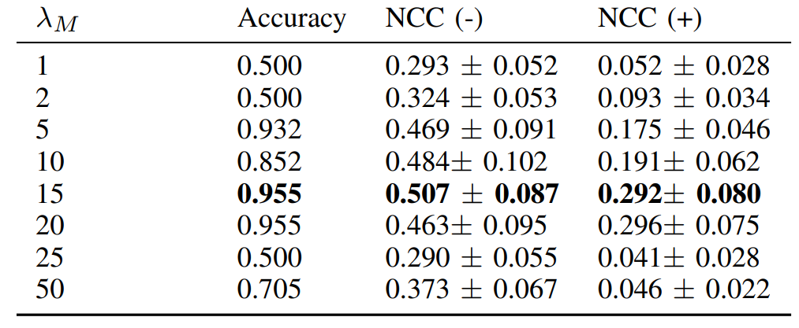
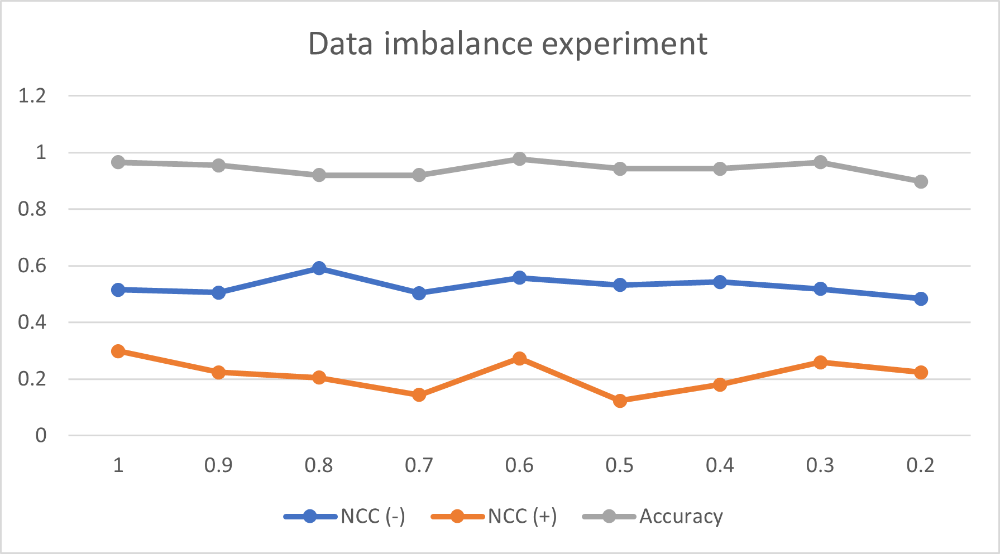

# ICAM: Interpretable Classification via Disentangled Representations and Feature Attribution Mapping

Feature attribution (FA), or the assignment of class-relevance to different locations in an image, is important for many classification problems but is particularly crucial within the neuroscience domain, where accurate mechanistic models of behaviours, or disease, require knowledge of all features discriminative of a trait. At the same time, predicting class relevance from brain images is challenging as phenotypes are typically heterogeneous, and changes occur against a background of significant natural variation. Here, we present a novel framework for creating class specific FA maps through image-to-image translation. We propose the use of a VAE-GAN to explicitly disentangle class relevance from background features for improved interpretability properties, which results in meaningful FA maps. We validate our method on 2D and 3D brain image datasets of dementia (ADNI dataset), ageing (UK Biobank), and (simulated) lesion detection. We show that FA maps generated by our method outperform baseline FA methods when validated against ground truth. More significantly, our approach is the first to use latent space sampling to support exploration of phenotype variation. 


This figure from the paper shows a comparison of different feature attribution methods for the ADNI dataset (Alzhiemer's dataset - conversion of AD to MCI) using a ground truth mask.


## Summary
We developed a method for feature attribution which supports 2D and 3D datasets for the tasks of classification and regression.
New datasets are easy to set up, requiring the desired dataset, and minimal addition of dataloader code.
Multi-class classification is also possible, but will require setting up an appropriate dataloader, and updating the training code.

## Requirements
Install Python 3.7 with the following libraries:

`Pytorch 1.1.0, torchvision 0.2.2, argparse, matplotlib, PIL, tensorboardX, nibabel, scipy, numpy, sklearn, skimage, h5py, SimpleITK, pandas`

Now also works with:
`Pytorch 1.8.1, torchvision 0.9.1`

For 3D datasets - TITAN GPU with 24GB memory is required for training.

## Datasets

Since we cannot release the datasets used in the paper, we instead provide an example using a simulated datasets of noise and squares.

Below is an example of a simulated dataset (on the left) of 2 classes - 1 noisy image with squares, and one without squares. The goal is to find the squares, and achieve translation between the classes. Here we show an example output after 20 epochs of training with original inputs, masks (i.e. location of squares), translation (between class 0 and 1), translation with random attribute, and feature attribution maps.


Please check related websites for getting the datasets used in the paper:

http://adni.loni.usc.edu/

https://www.ukbiobank.ac.uk/

https://www.humanconnectome.org/

http://www.developingconnectome.org/


## Instructions - how to run 2D simulated dataset
To run the 2D simulated dataset example, install python 3.7 with relevant libraries (listed above- recommended using a virtual environment), and run:
`python train.py`
It will run ICAM with default parameters on the simulated squares dataset, and save results to /results.

- You can change parameters in `options.py`.

## Instructions - how to train using cross-validation
To run the model with cross-validation, set --cross_validation to 'True' and add your own or choose one of the datasets available (either 'dhcp_2d_crossval', 'biobank_age_crossval' or 'syn2d_crossval') in 'options.py'. The data is divided in 90% for train/validation and 10% for a hold-out test set. The number of folds used in training is by default 5 - this can be changed in the parameter KFOLDS in 'train.py'. 

## Instructions - how to add new/ 3D dataset

Using biobank dataset with ICAM code:
- It is possible to train using biobank dataset using the current dataset classes implemented, however the data needs to be in the correct format:
You should have an image_path folder with all the images to be loaded in NIfTI format (.nii.gz), and label_path to labels in pickle format. In the labels file you should have the following columns to be compatible with this dataloader: age, id, sex. For other label files changes would be required in the code (see biobank_dataloader.py).

To add new dataset/ dataloaders:
- Note that to change datasets, a new dataloader would be needed with the following outputs: [tensor image, tensor label (regression), tensor mask].
Add this dataloader to `train.py` as another option. 

- For an example of how to add an additional dataset, see biobank_dataloader.py.

- Example of creating dataloaders in done using init_biobank_age_dataloader() function in dataloader_utils.py

- Once a new datataloader is added, it should be added as an option in train.py. E.g.:

```
print('\n--- load dataset ---')
# can add option for new dataloaders here
if opts.data_type == 'syn2d':
    healthy_dataloader, healthy_val_dataloader, healthy_test_dataloader, \
    anomaly_dataloader, anomaly_val_dataloader, anomaly_test_dataloader = _load_dataloader(opts)
elif opts.data_type == 'biobank_age':
    healthy_dataloader, healthy_val_dataloader, healthy_test_dataloader, \
    anomaly_dataloader, anomaly_val_dataloader, anomaly_test_dataloader = init_biobank_age_dataloader(opts)
```


- It is recommended to resize your datasets to [128, 128] for 2D datasets or [128, 160, 128] for 3D datasets. 
Alternatively, some changes might be needed in the networks to run on datasets of different dimensions. See `networks.py` and `networks_3d.py`. 
`nz` parameter might also need to be changed in `options.py`.

- Other parameters which need to be changed to run a 3D dataset (see `options.py`):
  - data_dim - run with data_dim = '3d'
  - regression - to run with regression, change regression to True. Note that an appropriate dataset would need to be used (not possible with 2D simulated dataset example).
  - label_path - new label path
  - dataroot - new image folder path
  - data_type - change to new datatype e.g. biobank_age


## Citing our paper

https://arxiv.org/abs/2006.08287

https://arxiv.org/abs/2103.02561

If this repository was useful to your work, please consider citing us:

`@article{bass2020icam,
  title={ICAM: Interpretable Classification via Disentangled Representations and Feature Attribution Mapping},
  author={Bass, C and Silva, MD and Sudre, CH and Tudosiu, PD and Smith, SM and Robinson, EC},
  journal={NeurIPS 2020},
  year={2020}
}`

`@article{bass2021icam,
  title={ICAM-reg: Interpretable Classification and Regression with Feature Attribution for Mapping Neurological Phenotypes in Individual Scans},
  author={Bass, Cher and da Silva, Mariana and Sudre, Carole and Williams, Logan ZJ and Tudosiu, Petru-Daniel and Alfaro-Almagro, Fidel and Fitzgibbon, Sean P and Glasser, Matthew F and Smith, Stephen M and Robinson, Emma C},
  journal={arXiv preprint arXiv:2103.02561},
  year={2021}
}`


## Supplemental materials: Ablation and Parameter Optimisation
In this section, the design of the network and choice of parameters were validated using a biologically plausible 2D lesion simulation, derived using the HCP multimodal parcellation (HCP-MMP v 1.0) (Glasser et al., 2016). This dataset was specifically chosen, since it captures extensive topographic variation across individuals, thereby supporting the extension of the 2-class simulation presented in Baumgartner et al (2018) to one that captures a realistic model of cortical heterogeneity.



Figure 1: Example of a 2D MRI axial slice from the HCP dataset with and without lesions. We note that the simulated lesions are of similar pixel intensities to the CSF. This is often observed in pathological lesions, and can make them challenging to detect.

In these experiments, the baseline class (class 0 - no lesions) was sampled from HCP subjects' original T2 weighted MRI scans, whereas a heterogeneous 'patient' class (class 1 - with lesions) was generated by simulating lesions from HCP-MMP v1.0 areas by artificially increasing their intensities. The experiment used 2D axial slices from the centre of the brain, simulating lesions from a subset of areas commonly found in these slices. Lesions were sampled with different probabilities: the medial temporal regions (MT) were lesioned in all subjects; however, OP1 (posterior opercular cortex), v23ab (posterior cingulate cortex), and 9a, (medial prefrontal cortex) were lesioned with probability of 0.5 to simulate heterogeneity in disease presentation.


Networks are compared using accuracy score and normalised cross correlation (NCC) between the absolute values of the attribution maps and the ground truth masks. The positive NCC (+) compares the lesion mask to the attribution map when translating between class 0 to 1 (adding lesions), and vice versa (removing lesions) for the negative NCC (-). Values reported are the mean and standard deviation across the test subjects.



Table 1: ICAM ablation experiments in the HCP dataset.

Table 1 (top) demonstrates performance of the network under ablation. Here, ICAM_DRIT represents a baseline re-implementation of the DRIT++ network (Lee et al., 2019) modified to support much more compact architecture (see Bass et al., 2020 for more details); ICAM_BCE reflects extension of DRIT++ integrating the classifier on the latent space and adding the rejection sampling module during training, ICAM_FA additionally integrates FA map regularisation, and ICAM represents the full network, which incorporates the L2 reconstruction loss. Each component of the network improves performance (either NCC+ or NCC-). We note that the BCE loss (including rejection sampling) improves of NCC (+) quite a lot which is harder as learning to add lesions is more difficult than removing them.


Table 2: FA map regularisation experiment (sweep of lambda M parameter) in the HCP dataset.

Since high values of lambda_M (FA map regularisation) may degrade performance by enforcing too much sparsity on the generated difference maps, we additionally investigated performance for different values (Table 2). Results show that performance is largely stable for lambda_M in the range 10-20 but performance degrades when this value is less than 5 or greater than 20.


Figure 2: Effect of class imbalance on NCC and Accuracy in the HCP dataset.

Finally, we investigated the impact of class imbalance on ICAM by changing class imbalance from 1 (no imbalance - using all data from group 1) to 0.2 (high imbalance - using 20% of data from group 1). We show in Figure 2 that class imbalance has a minimal impact on NCC- (changing from 0.52 to 0.48), NCC+ (0.30 to 0.22) and Accuracy (0.97 to 0.90), when comparing no class imbalance to a high class imbalance (0.2).

### References:

Bass, C., da Silva, M., Sudre, C., Tudosiu, P.D., Smith, S. and Robinson, E., 2020. Icam: Interpretable classification via disentangled representations and feature attribution mapping. Advances in Neural Information Processing Systems, 33, pp.7697-7709.

Baumgartner, C.F., Koch, L.M., Tezcan, K.C., Ang, J.X. and Konukoglu, E., 2018. Visual feature attribution using wasserstein gans. In Proceedings of the IEEE Conference on Computer Vision and Pattern Recognition (pp. 8309-8319).

Glasser, M.F., Coalson, T.S., Robinson, E.C., Hacker, C.D., Harwell, J., Yacoub, E., Ugurbil, K., Andersson, J., Beckmann, C.F., Jenkinson, M. and Smith, S.M., 2016. A multi-modal parcellation of human cerebral cortex. Nature, 536(7615), pp.171-178.

Lee, H.Y., Tseng, H.Y., Huang, J.B., Singh, M. and Yang, M.H., 2018. Diverse image-to-image translation via disentangled representations. In Proceedings of the European conference on computer vision (ECCV) (pp. 35-51).
