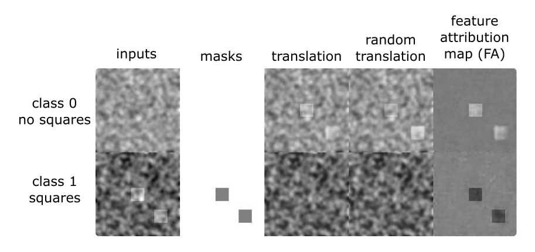

# ICAM: Interpretable Classification via Disentangled Representations and Feature Attribution Mapping

Feature attribution (FA), or the assignment of class-relevance to different locations in an image, is important for many classification problems but is particularly crucial within the neuroscience domain, where accurate mechanistic models of behaviours, or disease, require knowledge of all features discriminative of a trait. At the same time, predicting class relevance from brain images is challenging as phenotypes are typically heterogeneous, and changes occur against a background of significant natural variation. Here, we present a novel framework for creating class specific FA maps through image-to-image translation. We propose the use of a VAE-GAN to explicitly disentangle class relevance from background features for improved interpretability properties, which results in meaningful FA maps. We validate our method on 2D and 3D brain image datasets of dementia (ADNI dataset), ageing (UK Biobank), and (simulated) lesion detection. We show that FA maps generated by our method outperform baseline FA methods when validated against ground truth. More significantly, our approach is the first to use latent space sampling to support exploration of phenotype variation. 

This figure from the paper shows a comparison of different feature attribution methods for the ADNI dataset (Alzhiemer's dataset - conversion of AD to MCI) using a ground truth mask.

## Summary
We developed a method for feature attribution which supports 2D and 3D datasets for the tasks of classification and regression.
New datasets are easy to set up, requiring the desired dataset, and minimal addition of dataloader code.
Multi-class classification is also possible, but will require setting up an appropriate dataloader, and updating the training code.

## Requirements
Install Python 3.7 with the following libraries:

`Pytorch 1.1.0, torchvision 0.2.2, argparse, matplotlib, PIL, tensorboardX, nibabel, scipy, numpy, sklearn, skimage, h5py, SimpleITK, pandas`

Now also works with:
`Pytorch 1.8.1, torchvision 0.9.1`

For 3D datasets - TITAN GPU with 24GB memory is required for training.

## Datasets

Since we cannot release the datasets used in the paper, we instead provide an example using a simulated datasets of noise and squares.

Below is an example of a simulated dataset (on the left) of 2 classes - 1 noisy image with squares, and one without squares. The goal is to find the squares, and achieve translation between the classes. Here we show an example output after 20 epochs of training with original inputs, masks (i.e. location of squares), translation (between class 0 and 1), translation with random attribute, and feature attribution maps.

Please check related websites for getting the datasets used in the paper:

http://adni.loni.usc.edu/

https://www.ukbiobank.ac.uk/

https://www.humanconnectome.org/

## Instructions
To run the 2D simulated dataset example, install python 3.7 with relevant libraries (listed above- recommended using a virtual environment), and run:
`python train.py`
It will run ICAM with default parameters on the simulated squares dataset, and save results to /results.

- You can change parameters in `options.py`.

- To run with regression, change regression to True in `options.py`. Note that an appropriate dataset would need to be used (not possible with 2D simulated dataset example).

- Note that to change datasets, a new dataloader would be needed with the following outputs: [tensor image, tensor label (regression), tensor mask].
Add this dataloader to `train.py` as another option. 

- It is recommended to resize your datasets to [128, 128] for 2D datasets or [128, 160, 128] for 3D datasets. 
Alternatively, some changes might be needed in the networks to run on datasets of different dimensions. See `networks.py` and `networks_3d.py`. 
`nz` parameter might also need to be changed in `options.py`.

## Reference

https://arxiv.org/abs/2006.08287

https://arxiv.org/abs/2103.02561

If this repository was useful to your work, please consider citing us:

`@article{bass2020icam,
  title={ICAM: Interpretable Classification via Disentangled Representations and Feature Attribution Mapping},
  author={Bass, C and Silva, MD and Sudre, CH and Tudosiu, PD and Smith, SM and Robinson, EC},
  journal={NeurIPS 2020},
  year={2020}
}`

`@article{bass2021icam,
  title={ICAM-reg: Interpretable Classification and Regression with Feature Attribution for Mapping Neurological Phenotypes in Individual Scans},
  author={Bass, Cher and da Silva, Mariana and Sudre, Carole and Williams, Logan ZJ and Tudosiu, Petru-Daniel and Alfaro-Almagro, Fidel and Fitzgibbon, Sean P and Glasser, Matthew F and Smith, Stephen M and Robinson, Emma C},
  journal={arXiv preprint arXiv:2103.02561},
  year={2021}
}`
